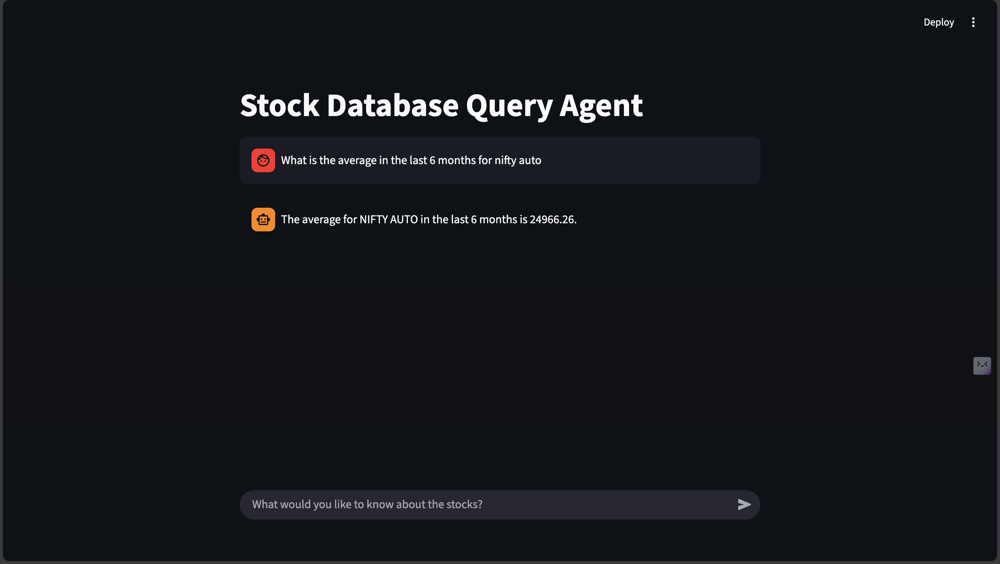

# Stock Database Query Agent

This application provides a Streamlit interface to query a stock database using a Langchain agent.

## Setup Instructions

Follow these steps to set up and run the application:

### 1. Clone the Repository (if not already cloned)

```bash
git clone https://github.com/ArthamXTradebook/AI.git
cd stock_agent_own
```

### 2. Create a Virtual Environment

It's recommended to use a virtual environment to manage dependencies.

```bash
python -m venv venv
```

### 3. Activate the Virtual Environment

- **On macOS/Linux:**
  ```bash
  source venv/bin/activate
  ```
- **On Windows:**
  ```bash
  .\venv\Scripts\activate
  ```

### 4. Install Dependencies

Install the required Python packages using `pip`:

```bash
pip install -r requirements.txt
```

### 5. Set up Google API Key

The application requires a Google API Key. Create a `.env` file in the root directory of the project and add your API key:

```
GOOGLE_API_KEY="your_google_api_key_here"
```

Replace `"your_google_api_key_here"` with your actual Google API Key.

### 6. Prepare the Database

Ensure you have a `stock.db` SQLite database in the root directory. If you need to convert dates in your `stock_index_price` table, you can run the `convert_dates.py` script:

```bash
python convert_dates.py
```

### 7. Run the Streamlit Application

Once all dependencies are installed and the API key is set, you can run the Streamlit application:

```bash
streamlit run app.py
```

This will open the application in your web browser.

## UI Screenshot


